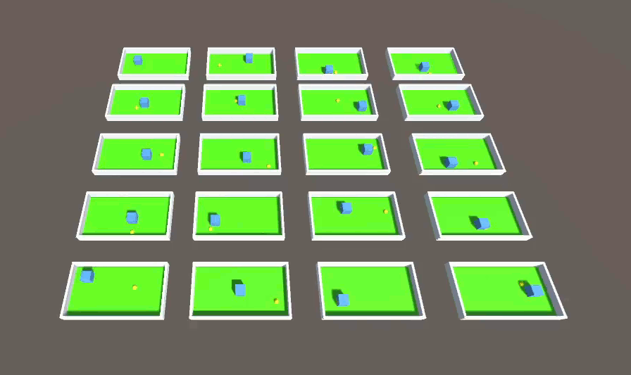

# Move to Goal Project

In this Unity-based problem, I've created a simple learning environment for a non-player character (NPC) using the ML-Agents toolkit. The primary objective of this project is to train an intelligent NPC to navigate and move towards a random goal within the game world.

## About

The NPC was trained with Proximal Policy Optimization (PPO) through reinforcement learning techniques, hence it gathers experience, makes decisions, and refines its abilities over time. As it interacts with its surroundings, it gradually comprehends the concept of spatial awareness and optimal paths. The main goal is to have the NPC autonomously reach its target.

The reinforcement learning setup involves the following components:

- **Observations**: Continuous location of the agent and the target with boundaries at -7f to 9f (x), 1f (y), -3f to 4f (z). **[ISSUE1](https://github.com/ramonlins/AI-Driven-Game-NPCs/issues/1)** : Agent can start at same position as the target, this creates a undesired behavior.

- **Actions**: Continuos actions to navigate towards the target with boundaries -8f, 9f (x), 1f (y), -3f, 4f (z)

- **Rewards**: +1 reward when reach the target, while receives a -1 rewards for collisions with wall.

## Getting Started

To get started with the project, follow these steps:

1. Clone this repository to your local machine.
2. Open the Unity project and explore the assets and scripts.
3. Train or run the project to use the NPC learning process or observe its goal-oriented movement.

## Usage

- For training the NPC or running the project, please refer to the documentation in the project folders.
- Feel free to experiment and modify the project to further develop the NPC's capabilities or apply it to your own game.

## Reference
Code was adapted from tutorial from code monkey https://www.youtube.com/watch?v=zPFU30tbyKs

More details can be found in https://github.com/Unity-Technologies/ml-agents/blob/develop/docs/Installation.md
